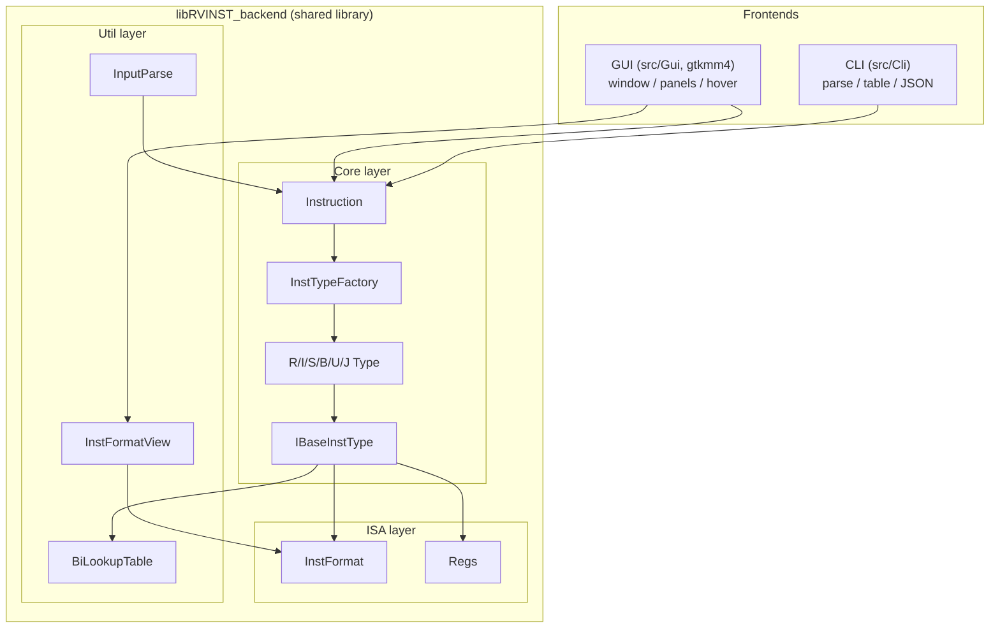

# RVINST

A RISC-V instruction encoder/decoder and visualization tool. It supports the six instruction formats (R / I / S / B / U / J) of the RISC-V base integer instruction set (RV32I), and provides two frontends — a command-line interface (CLI) and a GTKMM4 graphical interface — for bidirectional conversion among hexadecimal, binary, and assembly forms, plus bit-field layout visualization.

## Features

- **Decode / Encode**: Accepts hex (`0x008100b3`), binary (`0b00000000...`), and assembly (`add x1, x2, x8`) inputs, auto-detects the input kind and converts in both directions
- **Six instruction formats**: Full bit-field parsing and field display for R, I, S, B, U, and J type instructions
- **Field-level visualization**: Prints a field table (Field, Bits, Value, Detail) and a bit-field diagram for each instruction; register fields are resolved to both architectural and ABI names
- **Register lookup**: Built-in bidirectional mapping of all 32 general-purpose registers (x0~x31) and their ABI names (zero / ra / sp / ...)
- **Two frontends**:
  - CLI: `decode` / `encode` / `repl` / `reg` / `list` subcommands with colored, plain, and JSON output modes
  - GUI: GTKMM4 interface with input history, ABI toggle, per-format panels, hover highlighting, and format switching
- **Version info**: The short git hash is injected as the version string at configure time

## Requirements

- `CMake 3.27+` `ninja`
- A compiler with C++23/26 support (GCC 14+ or Clang 18+, relying on `<format>` / `<print>`)
- Threads (pthread)
- **GUI frontend**: `gtkmm-4.0` (found via pkg-config, `pkg-config gtkmm-4.0`)

  Install `gtkmm-4.0` on common Linux distributions:

  ```bash
  # Arch Linux
  sudo pacman -S gtkmm-4.0

  # Debian / Ubuntu
  sudo apt install libgtkmm-4.0-dev

  # Fedora
  sudo dnf install gtkmm4.0-devel
  ```
- **Logger submodule**: a git submodule that must be initialized and fetched
- Optional: `clang-format`, `clang-tidy` (used by the `fmt` / `tidy` check targets)

## Build

### 1. Clone and initialize submodules

```bash
git clone https://github.com/Baiyi27/RVINST --recurse-submodules
```

### 2. Configure and build

```bash
cmake -S . -B build -DCMAKE_BUILD_TYPE=Release -G Ninja
cmake --build build
```

Artifacts are output to `build/bin/`:

- `RVINST_cli.exe`: command-line frontend
- `RVINST_gui.exe`: GTKMM4 graphical frontend
- `libRVINST_backend.so`: shared backend library (shared by CLI / GUI)

### 3. Code checks (optional)

```bash
cmake --build build -t fmt    # clang-format
cmake --build build -t tidy   # clang-tidy
```

> For cross-compilation (e.g. a RISC-V Linux toolchain), see `cmake/Modules/ToolsChainConf.cmake`.

## Usage

### CLI

```
RVINST <command> [options] [args]
```

| Command | Description |
|---------|-------------|
| `decode <input>` | Decode hex / binary to assembly |
| `encode <input>` | Encode assembly to hex / binary |
| `repl` | Enter interactive REPL mode |
| `reg <query>` | Look up register info (name or index) |
| `list [--type T]` | List supported instructions, optionally filtered by format (R/I/S/B/U/J) |

Global options:

| Option | Description |
|--------|-------------|
| `--abi` / `--no-abi` | Use ABI register names (zero/ra/sp...) or architectural names (x0/x1...); architectural is the default |
| `--json` | Output in JSON format |
| `-h, --help` | Show help message |
| `-v, --version` | Show version information |

Examples:

```bash
RVINST decode 0x008100b3          # decodes to add x1, x2, x8
RVINST decode 0x008100b3 --abi    # use ABI names
RVINST encode "add x1, x2, x8"    # encodes to 0x008100b3
RVINST reg a0                     # query a0 (x10)
RVINST reg 10
RVINST list --type R              # list R-type instructions
RVINST repl                       # interactive mode
```

Inside the REPL you can use `:help`, `:abi on|off`, `:json on|off`, and `:list [--type T]`; type `quit` / `q` / `exit` to leave.

### GUI

```bash
./build/bin/RVINST_gui.exe
```

- Enter hex / binary / assembly in the input box and click the parse button to see the result
- Input history: browse previous inputs with the arrow keys
- ABI toggle: switch register display between architectural and ABI names
- Instruction format panels: per-format (R/I/S/B/U/J) display; hovering a bit field highlights its related assembly / binary fields

## Directory Layout

```
RVINST/
├── CMakeLists.txt          # Top-level build script (shared backend + CLI/GUI)
├── cmake/Modules/          # CMake modules (CodeCheck, toolchain, clang-format/tidy)
├── inc/                    # Headers
│   ├── ISA/                # Instruction format definitions, register table
│   ├── Core/               # Instruction type abstraction & implementations, factory
│   ├── Util/               # Utilities: input parsing, bidirectional lookup table, format view, config
│   ├── Cli/                # CLI frontend interface
│   └── Gui/                # GUI frontend interface (gtkmm)
├── src/                    # Sources (mirroring inc/)
│   ├── Core/               # RType/IType/SType/BType/UType/JType, etc.
│   ├── Cli/                # CLI frontend implementation
│   └── Gui/                # GUI frontend implementation (incl. CSS styles)
├── Logger/                 # Logging library (git submodule)
└── tests/INST.cc           # Smoke tests (logging, registers, encode/decode)
```

## Architecture



Core decoding flow: `Instruction` builds the appropriate `IBaseInstType` subclass through `InstTypeFactory` from the input (machine code or assembly); the instruction name is matched via `BiLookupTable` using `functKey = (funct7 << 3) | funct3` (for R-type, etc.); then `Parse()` / `Disassembly()` perform field parsing and assembly output.

## Links

- [RVINST](https://github.com/Baiyi27/RVINST.git)
- [Logger](https://github.com/Baiyi27/Logger.git)
- [RISC-V instruction manual](https://riscv.github.io/riscv-unified-db/manual/html/isa/)
- [RISC-V docs](https://docs.riscv.org/reference/)
